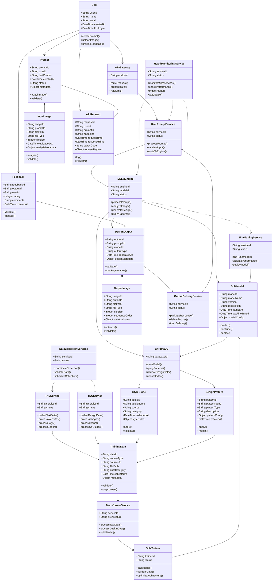

# Class Diagram

## Metadata
- **Type**: Class Diagram
- **Workspace**: Experience Small Language Model 
- **Generated**: 11/22/2025, 10:24:01 AM

## Diagram

```mermaid
classDiagram
    class User {
        +String userId
        +String name
        +String email
        +DateTime createdAt
        +DateTime lastLogin
        +createPrompt()
        +uploadImage()
        +provideFeedback()
    }

    class APIGateway {
        +String endpoint
        +routeRequest()
        +authenticate()
        +rateLimit()
    }

    class UserPromptService {
        +String serviceId
        +String status
        +processPrompt()
        +validateInput()
        +routeToEngine()
    }

    class Prompt {
        +String promptId
        +String userId
        +String textContent
        +DateTime createdAt
        +String status
        +Object metadata
        +attachImage()
        +validate()
    }

    class InputImage {
        +String imageId
        +String promptId
        +String filePath
        +String fileType
        +Integer fileSize
        +DateTime uploadedAt
        +Object analysisMetadata
        +analyze()
        +validate()
    }

    class DELMEngine {
        +String engineId
        +String modelId
        +String status
        +processPrompt()
        +analyzeImage()
        +generateDesign()
        +queryPatterns()
    }

    class SLMModel {
        +String modelId
        +String modelName
        +String version
        +String modelPath
        +DateTime trainedAt
        +DateTime lastFineTuned
        +Object modelConfig
        +predict()
        +fineTune()
        +deploy()
    }

    class SLMTrainer {
        +String trainerId
        +String status
        +trainModel()
        +validateData()
        +optimizeArchitecture()
    }

    class TransformerService {
        +String serviceId
        +String architecture
        +processTextData()
        +processDesignData()
        +buildModel()
    }

    class DataCollectionServices {
        +String serviceId
        +String status
        +coordinateCollection()
        +validateData()
        +scheduleCollection()
    }

    class TADService {
        +String serviceId
        +String status
        +collectTextData()
        +processWebsites()
        +processLogs()
        +processBooks()
    }

    class TDCService {
        +String serviceId
        +String status
        +collectDesignData()
        +processImages()
        +processIcons()
        +processUIGuides()
    }

    class TrainingData {
        +String dataId
        +String sourceType
        +String sourceUrl
        +String filePath
        +String dataCategory
        +DateTime collectedAt
        +Object metadata
        +validate()
        +preprocess()
    }

    class FineTuningService {
        +String serviceId
        +String status
        +fineTuneModel()
        +validatePerformance()
        +deployModel()
    }

    class DesignOutput {
        +String outputId
        +String promptId
        +String modelId
        +String outputType
        +DateTime generatedAt
        +Object designMetadata
        +validate()
        +packageImages()
    }

    class OutputImage {
        +String imageId
        +String outputId
        +String filePath
        +String fileType
        +Integer fileSize
        +Integer sequenceOrder
        +Object styleAttributes
        +optimize()
        +validate()
    }

    class OutputDeliveryService {
        +String serviceId
        +String status
        +packageResponse()
        +deliverToUser()
        +trackDelivery()
    }

    class StyleGuide {
        +String guideId
        +String guideName
        +String source
        +String category
        +DateTime collectedAt
        +Object styleRules
        +apply()
        +validate()
    }

    class DesignPattern {
        +String patternId
        +String patternName
        +String patternType
        +String description
        +Object patternConfig
        +DateTime createdAt
        +apply()
        +match()
    }

    class ChromaDB {
        +String databaseId
        +storeModel()
        +queryPatterns()
        +retrieveDesignData()
        +updateIndex()
    }

    class HealthMonitoringService {
        +String serviceId
        +String status
        +monitorMicroservices()
        +checkPerformance()
        +triggerAlerts()
        +autoScale()
    }

    class APIRequest {
        +String requestId
        +String userId
        +String promptId
        +String endpoint
        +DateTime requestTime
        +DateTime responseTime
        +String statusCode
        +Object requestPayload
        +log()
        +validate()
    }

    class Feedback {
        +String feedbackId
        +String outputId
        +String userId
        +Integer rating
        +String comments
        +DateTime createdAt
        +validate()
        +analyze()
    }

    %% Core User Interactions
    User --> APIGateway
    APIGateway --> UserPromptService
    User --> Prompt
    Prompt *-- InputImage

    %% Processing Flow
    UserPromptService --> DELMEngine
    DELMEngine --> SLMModel
    DELMEngine --> ChromaDB
    DELMEngine --> DesignOutput
    DesignOutput *-- OutputImage
    DesignOutput --> OutputDeliveryService

    %% Training Pipeline
    DataCollectionServices --> TADService
    DataCollectionServices --> TDCService
    TADService --> TrainingData
    TDCService --> TrainingData
    TrainingData --> TransformerService
    TransformerService --> SLMTrainer
    SLMTrainer --> SLMModel
    FineTuningService --> SLMModel
    SLMModel --> ChromaDB

    %% Design Resources
    ChromaDB --> StyleGuide
    ChromaDB --> DesignPattern
    StyleGuide --> TrainingData
    DesignPattern --> TrainingData

    %% Monitoring and Feedback
    HealthMonitoringService ..> UserPromptService
    HealthMonitoringService ..> DELMEngine
    HealthMonitoringService ..> OutputDeliveryService
    User --> APIRequest
    User --> Feedback
    Feedback --> DesignOutput

    %% Dependencies
    Prompt --> APIRequest
    DELMEngine ..> FineTuningService
    OutputDeliveryService --> UserPromptService
```
