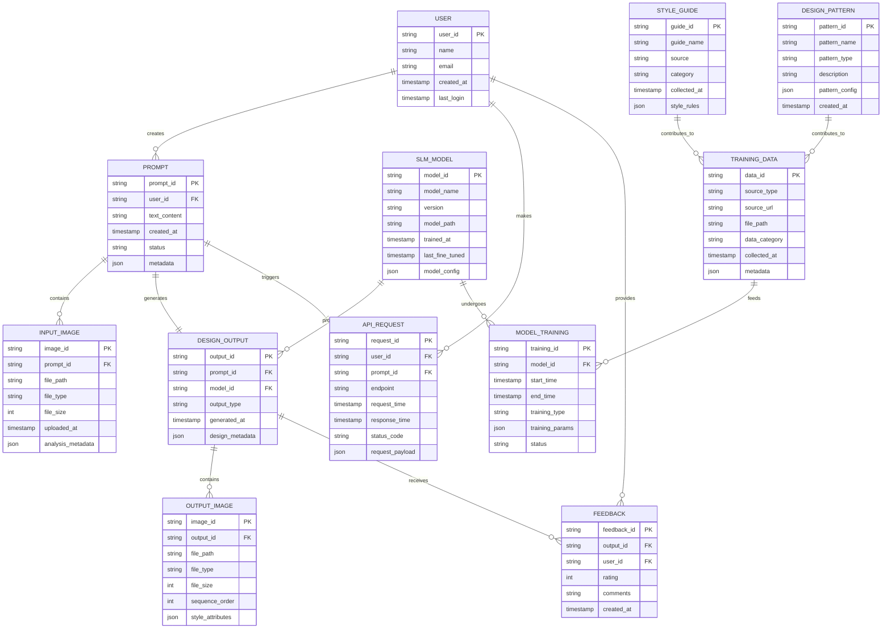

# Data Model

## Metadata
- **Type**: Data Model
- **Workspace**: Experience Small Language Model 
- **Generated**: 11/22/2025, 10:24:01 AM

## Diagram

```mermaid
erDiagram
    USER {
        string user_id PK
        string name
        string email
        timestamp created_at
        timestamp last_login
    }
    
    PROMPT {
        string prompt_id PK
        string user_id FK
        string text_content
        timestamp created_at
        string status
        json metadata
    }
    
    INPUT_IMAGE {
        string image_id PK
        string prompt_id FK
        string file_path
        string file_type
        int file_size
        timestamp uploaded_at
        json analysis_metadata
    }
    
    SLM_MODEL {
        string model_id PK
        string model_name
        string version
        string model_path
        timestamp trained_at
        timestamp last_fine_tuned
        json model_config
    }
    
    TRAINING_DATA {
        string data_id PK
        string source_type
        string source_url
        string file_path
        string data_category
        timestamp collected_at
        json metadata
    }
    
    DESIGN_OUTPUT {
        string output_id PK
        string prompt_id FK
        string model_id FK
        string output_type
        timestamp generated_at
        json design_metadata
    }
    
    OUTPUT_IMAGE {
        string image_id PK
        string output_id FK
        string file_path
        string file_type
        int file_size
        int sequence_order
        json style_attributes
    }
    
    API_REQUEST {
        string request_id PK
        string user_id FK
        string prompt_id FK
        string endpoint
        timestamp request_time
        timestamp response_time
        string status_code
        json request_payload
    }
    
    STYLE_GUIDE {
        string guide_id PK
        string guide_name
        string source
        string category
        timestamp collected_at
        json style_rules
    }
    
    DESIGN_PATTERN {
        string pattern_id PK
        string pattern_name
        string pattern_type
        string description
        json pattern_config
        timestamp created_at
    }
    
    MODEL_TRAINING {
        string training_id PK
        string model_id FK
        timestamp start_time
        timestamp end_time
        string training_type
        json training_params
        string status
    }
    
    FEEDBACK {
        string feedback_id PK
        string output_id FK
        string user_id FK
        int rating
        string comments
        timestamp created_at
    }

    USER ||--o{ PROMPT : creates
    USER ||--o{ API_REQUEST : makes
    USER ||--o{ FEEDBACK : provides
    PROMPT ||--o{ INPUT_IMAGE : contains
    PROMPT ||--|| DESIGN_OUTPUT : generates
    PROMPT ||--|| API_REQUEST : triggers
    SLM_MODEL ||--o{ DESIGN_OUTPUT : produces
    SLM_MODEL ||--o{ MODEL_TRAINING : undergoes
    DESIGN_OUTPUT ||--o{ OUTPUT_IMAGE : contains
    DESIGN_OUTPUT ||--o{ FEEDBACK : receives
    TRAINING_DATA ||--o{ MODEL_TRAINING : feeds
    STYLE_GUIDE ||--o{ TRAINING_DATA : contributes_to
    DESIGN_PATTERN ||--o{ TRAINING_DATA : contributes_to
```
