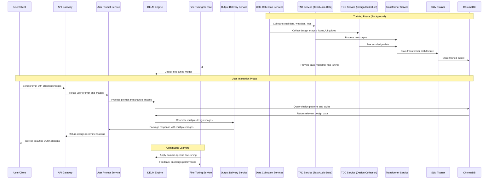

# Sequence Diagram

## Metadata
- **Type**: Sequence Diagram
- **Workspace**: Experience Small Language Model 
- **Generated**: 11/22/2025, 10:24:01 AM

## Diagram

```mermaid
sequenceDiagram
    participant User as User/Client
    participant API as API Gateway
    participant UPS as User Prompt Service
    participant DELM as DELM Engine
    participant FTS as Fine Tuning Service
    participant ODS as Output Delivery Service
    participant DCS as Data Collection Services
    participant TAD as TAD Service (Text/Audio Data)
    participant TDC as TDC Service (Design Collection)
    participant TS as Transformer Service
    participant SLM as SLM Trainer
    participant DB as ChromaDB

    Note over DCS,DB: Training Phase (Background)
    DCS->>TAD: Collect textual data, websites, logs
    DCS->>TDC: Collect design images, icons, UI guides
    TAD->>TS: Process text corpus
    TDC->>TS: Process design data
    TS->>SLM: Train transformer architecture
    SLM->>DB: Store trained model
    SLM->>FTS: Provide base model for fine-tuning
    FTS->>DELM: Deploy fine-tuned model

    Note over User,DB: User Interaction Phase
    User->>API: Send prompt with attached images
    API->>UPS: Route user prompt and images
    UPS->>DELM: Process prompt and analyze images
    DELM->>DB: Query design patterns and styles
    DB->>DELM: Return relevant design data
    DELM->>ODS: Generate multiple design images
    ODS->>UPS: Package response with multiple images
    UPS->>API: Return design recommendations
    API->>User: Deliver beautiful UI/UX designs

    Note over FTS,DELM: Continuous Learning
    FTS->>DELM: Apply domain-specific fine-tuning
    DELM->>FTS: Feedback on design performance
```
