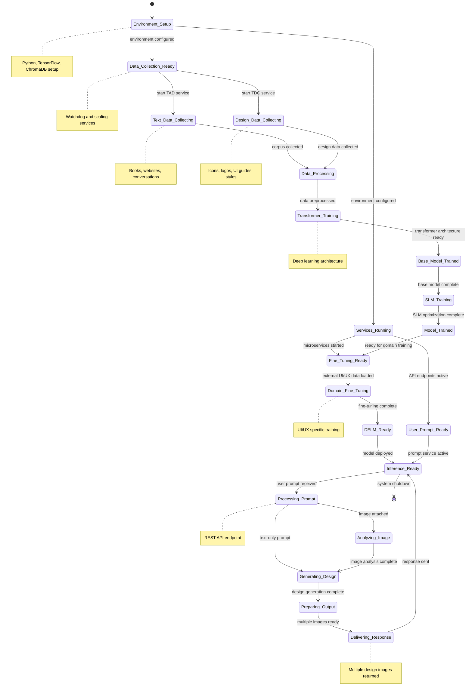

# State Diagram

## Metadata
- **Type**: State Diagram
- **Workspace**: Experience Small Language Model 
- **Generated**: 11/22/2025, 10:24:01 AM

## Diagram

```mermaid
stateDiagram-v2
    [*] --> Environment_Setup
    
    Environment_Setup --> Services_Running : environment configured
    Environment_Setup --> Data_Collection_Ready : environment configured
    
    Services_Running --> Fine_Tuning_Ready : microservices started
    Services_Running --> User_Prompt_Ready : API endpoints active
    
    Data_Collection_Ready --> Text_Data_Collecting : start TAD service
    Data_Collection_Ready --> Design_Data_Collecting : start TDC service
    
    Text_Data_Collecting --> Data_Processing : corpus collected
    Design_Data_Collecting --> Data_Processing : design data collected
    
    Data_Processing --> Transformer_Training : data preprocessed
    
    Transformer_Training --> Base_Model_Trained : transformer architecture ready
    
    Base_Model_Trained --> SLM_Training : base model complete
    
    SLM_Training --> Model_Trained : SLM optimization complete
    
    Model_Trained --> Fine_Tuning_Ready : ready for domain training
    
    Fine_Tuning_Ready --> Domain_Fine_Tuning : external UI/UX data loaded
    
    Domain_Fine_Tuning --> DELM_Ready : fine-tuning complete
    
    DELM_Ready --> Inference_Ready : model deployed
    User_Prompt_Ready --> Inference_Ready : prompt service active
    
    Inference_Ready --> Processing_Prompt : user prompt received
    
    Processing_Prompt --> Analyzing_Image : image attached
    Processing_Prompt --> Generating_Design : text-only prompt
    
    Analyzing_Image --> Generating_Design : image analysis complete
    
    Generating_Design --> Preparing_Output : design generation complete
    
    Preparing_Output --> Delivering_Response : multiple images ready
    
    Delivering_Response --> Inference_Ready : response sent
    
    Inference_Ready --> [*] : system shutdown
    
    note right of Environment_Setup : Python, TensorFlow, ChromaDB setup
    note right of Data_Collection_Ready : Watchdog and scaling services
    note right of Text_Data_Collecting : Books, websites, conversations
    note right of Design_Data_Collecting : Icons, logos, UI guides, styles
    note right of Transformer_Training : Deep learning architecture
    note right of Domain_Fine_Tuning : UI/UX specific training
    note right of Processing_Prompt : REST API endpoint
    note right of Delivering_Response : Multiple design images returned
```
