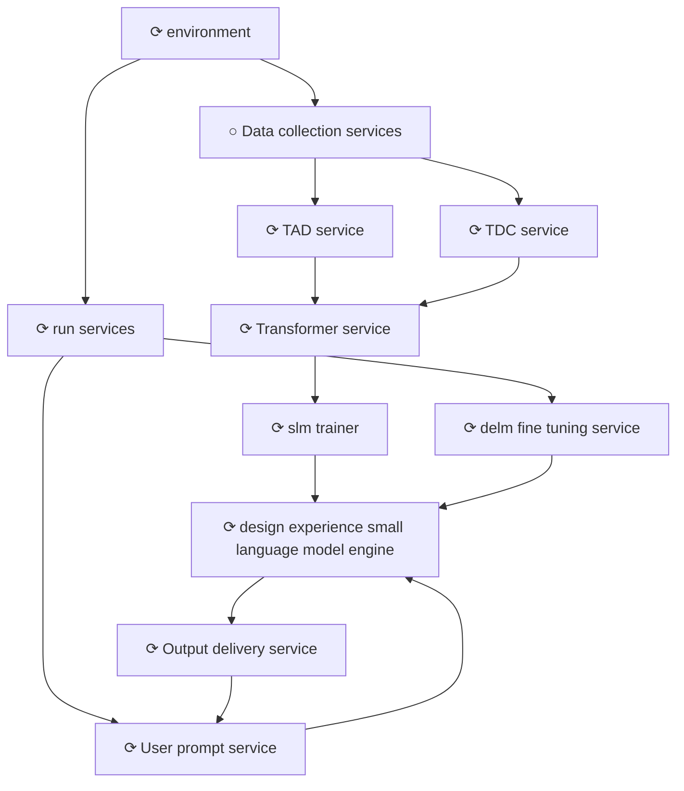

# Complete Flow Diagram

**Status:** pending

**Description:** ```mermaid



```mermaid
flowchart TD
    card1763829206167["⟳ environment"]
    card1763829400849["⟳ run services"]
    card1763830676528["⟳ TAD service"]
    card1763830855411["⟳ TDC service"]
    card1763830910343["⟳ Transformer service"]
    card1763830993693["○ Data collection services"]
    card1763831078693["⟳ slm trainer"]
    card1763831106842["⟳ design experience small language model engine"]
    card1763831142858["⟳ delm fine tuning service"]
    card1763831425365["⟳ User prompt service"]
    card1763831487223["⟳ Output delivery service"]
    card1763829206167 --> card1763829400849
    card1763829206167 --> card1763830993693
    card1763830993693 --> card1763830676528
    card1763830993693 --> card1763830855411
    card1763830676528 --> card1763830910343
    card1763830855411 --> card1763830910343
    card1763830910343 --> card1763831078693
    card1763831078693 --> card1763831106842
    card1763829400849 --> card1763831142858
    card1763831142858 --> card1763831106842
    card1763829400849 --> card1763831425365
    card1763831425365 --> card1763831106842
    card1763831106842 --> card1763831487223
    card1763831487223 --> card1763831425365
```
